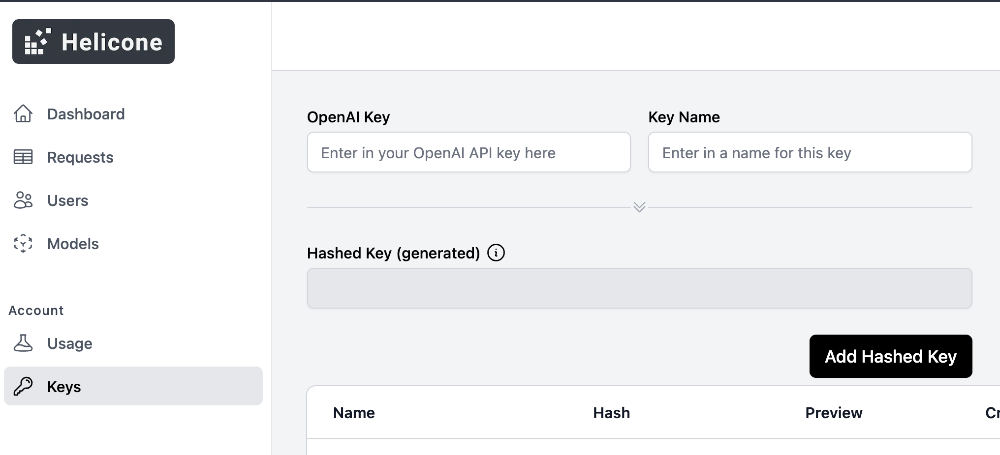

# Helicone

This page covers how to use the [Helicone](https://helicone.ai) within LangChain.

## What is Helicone?

Helicone is an [open source](https://github.com/Helicone/helicone) observability platform that proxies your OpenAI traffic and provides you key insights into your spend, latency and usage.


## Quick start

With your LangChain environment you can just add the following parameter.

```typescript
const model = new OpenAI(
  {},
  {
    basePath: "https://oai.hconeai.com/v1",
  }
);
const res = await model.call("What is a helicone?");
```

Now head over to [helicone.ai](https://helicone.ai/onboarding?step=2) to create your account, and add your OpenAI API key within our dashboard to view your logs.



## How to enable Helicone caching

```typescript
const model = new OpenAI(
  {},
  {
    basePath: "https://oai.hconeai.com/v1",
    baseOptions: {
      headers: {
        "Helicone-Cache-Enabled": "true",
      },
    },
  }
);
const res = await model.call("What is a helicone?");
```

[Helicone caching docs](https://docs.helicone.ai/advanced-usage/caching)

## How to use Helicone custom properties

```typescript
const model = new OpenAI(
  {},
  {
    basePath: "https://oai.hconeai.com/v1",
    baseOptions: {
      headers: {
        "Helicone-Property-Session": "24",
        "Helicone-Property-Conversation": "support_issue_2",
        "Helicone-Property-App": "mobile",
      },
    },
  }
);
const res = await model.call("What is a helicone?");
```

[Helicone property docs](https://docs.helicone.ai/advanced-usage/custom-properties)
